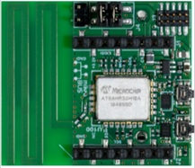
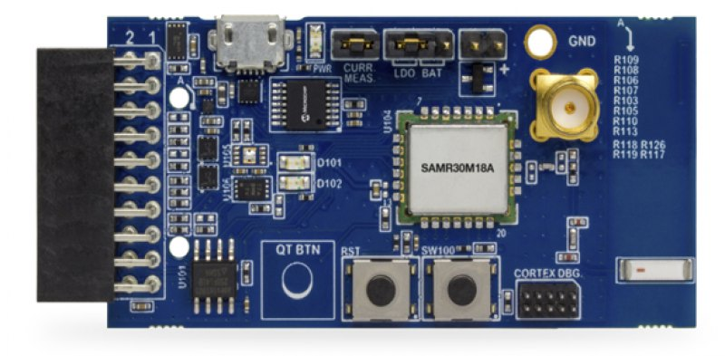
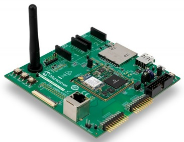
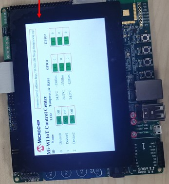
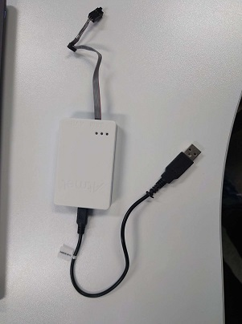
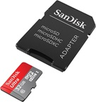
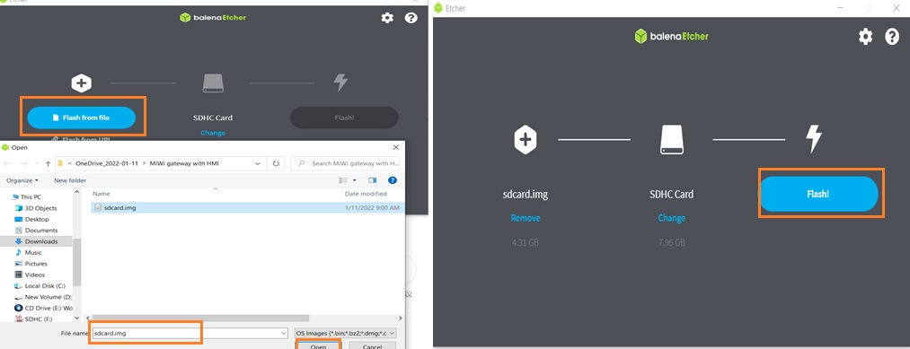
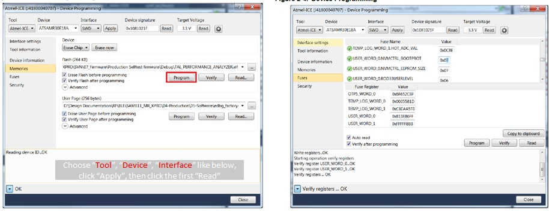
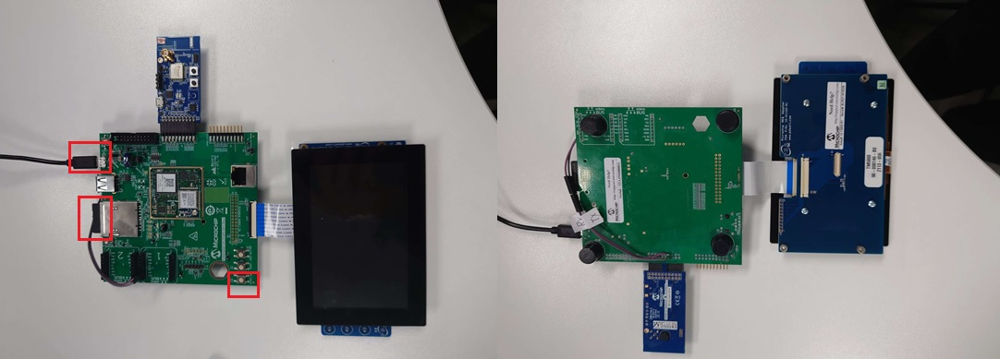
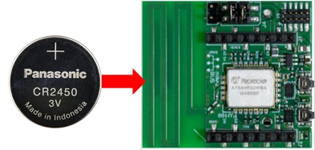

# MiWi Gateway with HMI demo Set up

> "Wireless Made Easy!"

Devices:  **ATSAMR30|ATSAMA5D27**

## ⚠ Disclaimer

<b>
THE SOFTWARE ARE PROVIDED "AS IS" AND GIVE A PATH FOR SELF-SUPPORT AND SELF-MAINTENANCE.  
This repository contains unsupported example code intended to help accelerate client product development. It is not validated for production nor audited for security best-practices.  
Note that while this repository is unsupported, Microchip welcome community contributions, and all pull-requests will be considered for inclusion into the repository.

</b>

> Interact with peers in the community at [MiWi Forum](https://www.microchip.com/forums/f507.aspx).

## Overview
MiWi Gateway with HMI demo setup will show you how to set up this demo. In this package, it includes the following four folders:

### 1.Firmware
Including all Firmwares which will be used in this demo.

### 2.images
Including all pictures in this demo.

### 3.Setup Guidance
Including PPT and video files which are used to show you how to set up this demo.

### 4.Source code
Including MiWi(Gateway and End device) source code, which you can use to develop your own applicaiton.

## Materials
To set up this demo, you should get the following two parts first.

### 1. Software
Go to the Firwmare folder and get all firmwares which will be used in this demo.

### 2. Hardware
The following hardwares which will be used in this demo include.

2.1 SAMR30M sensor board

2.2 SAMR30 Module XPro board

2.3 SAMA5D27 WLSOM1 EK1 board

2.4 LCD Display Module

2.5 Ateml ICE

2.6 SDCard 

## Start Demo Setup
Now, you should have gotten all materials,  please follow the following steps to complete this demo.

### 1. Programming Devices 
First, programing the devices which will be used in this demo.

##### 1.1 Programing SAMA5D27 MPU
Prepare an SD card(Size>8GB)

Insert the SD card into the SD card slot of laptop

Open the [balenaEtcher](https://www.balena.io/etcher/)

Load the MPU image and click the flash button

##### 1.2 Programing SAMR30 Module board
Open Microchip Studio, and then click the device programming from the down-list of tools menu

Using Atmel ICE to connect SAMR30 module to PC

Load the Hex file and then programe the SAMR30 module board.

refer to [SAMR30 module xpro user guide](https://ww1.microchip.com/downloads/en/DeviceDoc/SAM-R30-Module-Xplained-Pro-User-Guide-DS50002827A.pdf) for more details

##### 1.3 Programing SAMR30 sensor board
You can follow the programming SARM30 module board steps to programe SAMR30 sensor board

For more information, you can refer to [SAMR30M Sensor Board User's Guide](https://ww1.microchip.com/downloads/en/DeviceDoc/ATSAMR30M-Sensor-Board-User's-Guide-DS50003015A.pdf)

### 2 Hardware Setup
After progamming the devices, now you can start to set up the hardware.
##### 2.1 MiWi Gateway setup
Insert the SD card into the SD card slot of the MPU board

Connect MPU with MiWi SAMR30 module board

Connect LCD display module with MPU board

Connect USB cable to mini-USB port to provide 5V power

Tap the "START_SOM" button of the MPU board, and then wait ~25S until the MPU start up

##### 2.2 MiWi SAMR30 Sensor board setup
SARM30 sensor board acted as the end device, now you need to power on then, you just need to insert the battery, and then it will power on automatically.

Once the connection is estabilished, you will see the following four colomns

2.2.1 LED: You can change the LED status of the end device from the LCD display module.

2.2.2 Temperature: The end devices will report the ambient temperature automatically.

2.2.3 RSSI:You can get the recieved signal strength indicator(RSSI) information from the end devices.

2.2.4 GPIO1/2:You can control the GPIO1/2 status of the end devices from the LCD display module.

## ⚠ Warning
SAMR30 sensor will not enter into sleep mode, in order to save the power, it's better for you to long pressed the "USER_BTN" button (>2s) of the sensor board to put the sensor board into sleep mode or cut off the power of the sensor after finishing the demo.
